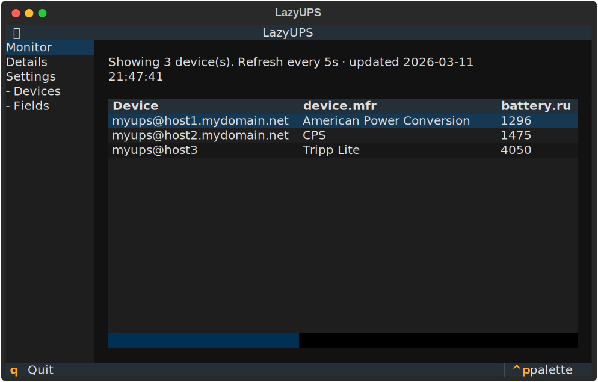
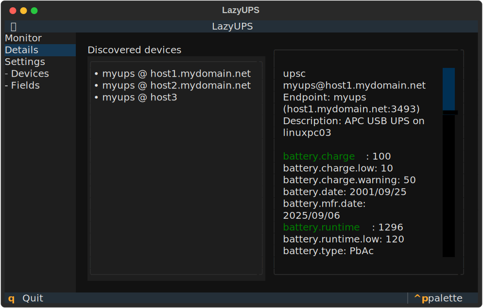
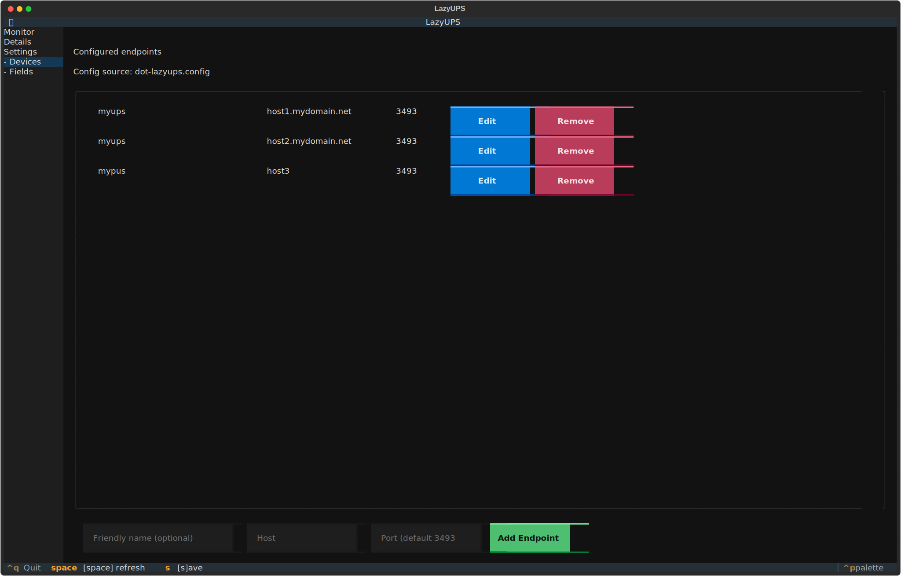
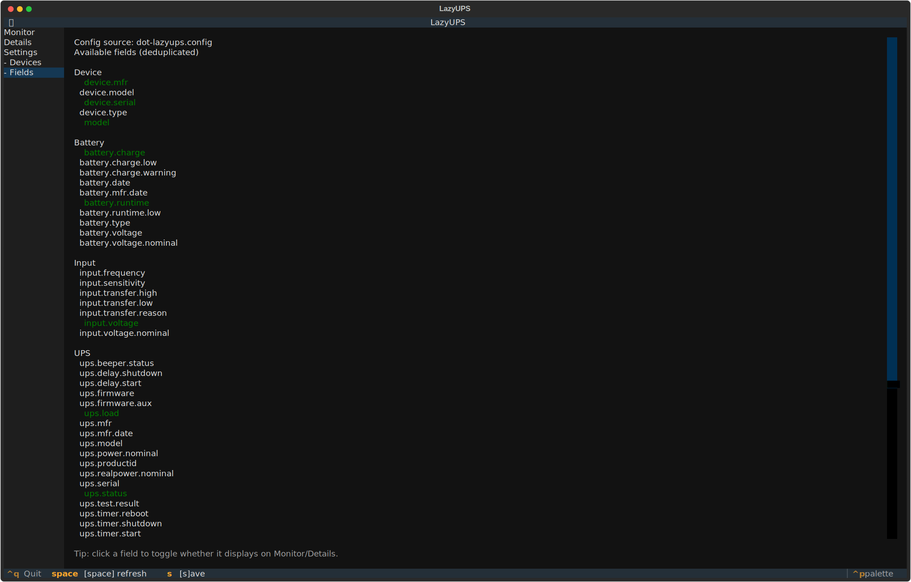

# LazyUPS

Terminal UI for monitoring NUT (`upsc`) UPS devices.

## Features

- Monitor view with live polling and refresh timestamp
- Details view for full `upsc <ups>@<host>` output
- Devices management (add/edit/remove endpoints)
- Fields view to control which values appear in Monitor/Details
  - Click any field to toggle it on/off
  - Selected fields are highlighted

## Install

Build the executable:

```bash
build-exectuable.exe
```

Then install it system-wide:

```bash
sudo cp dist/lazyups /usr/local/bin
```

## Run

```bash
./run.sh
```

Start on a specific page:

```bash
./run.sh --screen monitor
./run.sh --screen details
./run.sh --screen devices
./run.sh --screen fields
```

## Version

Current version: `01.00.00`

## Screenshots

### Monitor



### Details



### Devices



### Fields



## Development

Run tests:

```bash
./.venv/bin/python -m pytest -q
```

Build executable:

```bash
./build-exe.sh
```

## Release/version consistency

Check app/package/tag consistency:

```bash
./check-version-sync.sh
```

Tag format:

```text
v<app-version>
```

Example:

```text
v01.00.00
```
